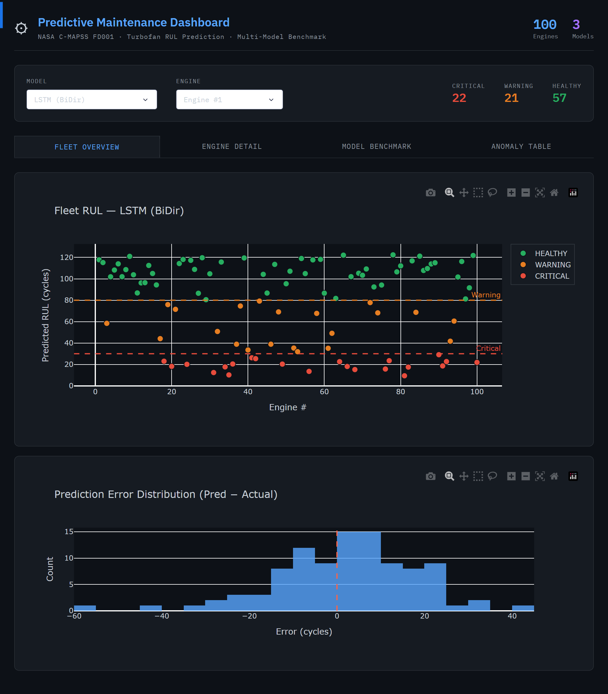
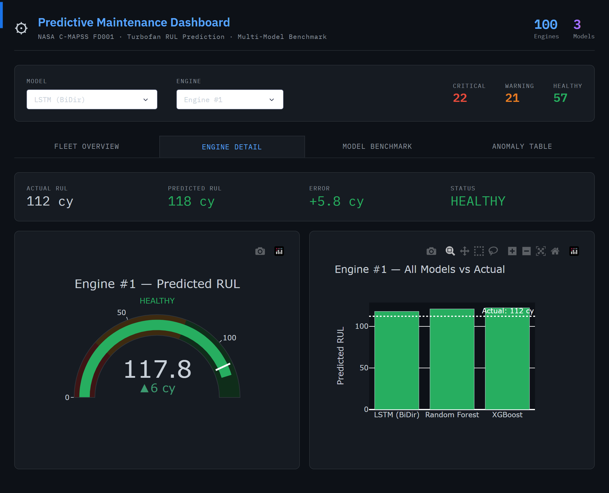
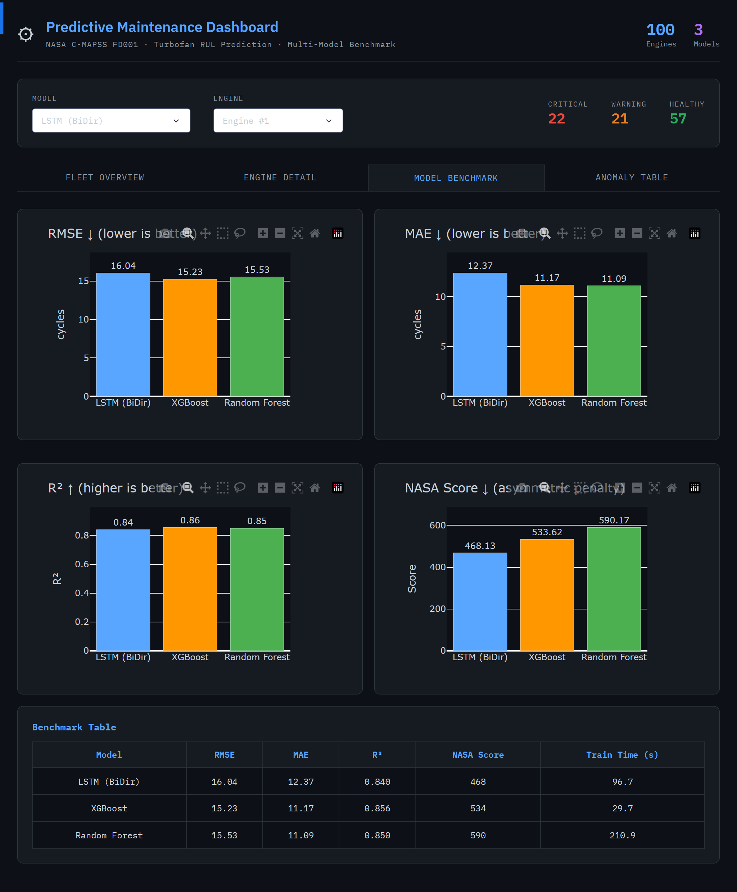
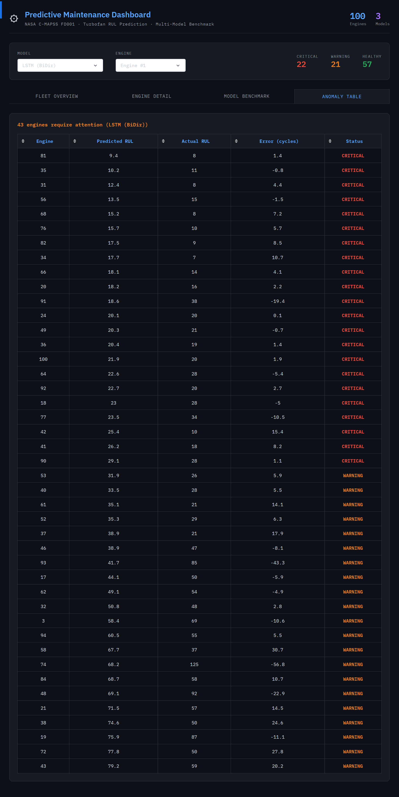

# Maintenance Prédictive — Moteurs Turbofan (NASA C-MAPSS)

> Prédiction de la Remaining Useful Life (RUL) de moteurs aéronautiques turbofan à l’aide du dataset NASA C-MAPSS.  
> Benchmark multi-modèles · Feature engineering · Analyse des coûts & ROI · Dashboard interactif
---

## Objectif

Les défaillances de moteurs aéronautiques provoquent des événements imprévus de type Aircraft-on-Ground (AOG), pouvant engendrer des pertes supérieures à **120 000 $ par jour** en maintenance d’urgence, retards opérationnels et pertes d’exploitation.
https://aircargoweek.com/the-real-cost-of-aog/?
L’objectif de ce projet est de développer un système de maintenance prédictive capable d’estimer le nombre de cycles de vol restants avant qu’un moteur nécessite une intervention de maintenance.

Cette approche permet :
- d’anticiper les défaillances critiques,
- de réduire les immobilisations imprévues,
- d’améliorer la disponibilité opérationnelle de la flotte,
- d’optimiser les coûts de maintenance,
- et de passer d’une maintenance fixe traditionnelle à une maintenance intelligente pilotée par la donnée et l’intelligence artificielle.

Le projet s’appuie sur plusieurs modèles de machine learning et deep learning afin de comparer leurs performances techniques, opérationnelles et économiques dans un contexte aéronautique réaliste.

---

## Dataset — NASA C-MAPSS FD001

Le dataset **Commercial Modular Aero-Propulsion System Simulation (C-MAPSS)** constitue une référence majeure dans les domaines du Prognostics and Health Management (PHM) et de la maintenance prédictive aéronautique.

Développé par la NASA, il simule la dégradation progressive de moteurs turbofan jusqu’à leur défaillance complète, permettant d’entraîner des modèles capables de prédire leur durée de vie restante (RUL).

| Paramètre        | Valeur                              |
|------------------|-------------------------------------|
| Dataset          | FD001 (condition opératoire unique) |
| Moteurs entraînement | 100                            |
| Moteurs test     | 100                                 |
| Capteurs         | 21 séries temporelles par moteur    |
| Variable cible   | Remaining Useful Life (cycles)      |
| Référence        | Saxena et al., PHM 2008             |

Chaque moteur possède :
- des paramètres opérationnels,
- plusieurs mesures capteurs évoluant dans le temps,
- une dégradation progressive simulée jusqu’à la panne.

L’objectif consiste à prédire le nombre de cycles restants avant défaillance à partir des signaux capteurs historiques.

> Saxena, A., Goebel, K., Simon, D., & Eklund, N. (2008). *Damage propagation modeling for aircraft engine run-to-failure simulation.* International Conference on Prognostics and Health Management (PHM). doi:10.1109/PHM.2008.4711414
---

## Structure du Projet

```text
cmapss_project/
│
├── data/
│   ├── train_FD001.txt          # Données brutes d’entraînement
│   ├── test_FD001.txt           # Données brutes de test
│   ├── RUL_FD001.txt            # Vérité terrain des RUL de test
│   ├── exploration/             # Figures EDA générées automatiquement
│   ├── processed/               # Données prétraitées générées automatiquement
│   ├── models/                  # Modèles entraînés + benchmark
│   └── reports/                 # Rapports d’analyse coûts & ROI
│
├── src/
│   ├── 01_data_exploration.py   # Analyse exploratoire : distributions, corrélations, PCA
│   ├── 02_preprocessing.py      # Feature engineering, RUL capping, création des séquences
│   ├── 03_train_model.py        # Entraînement multi-modèles + benchmark
│   ├── 04_dashboard.py          # Dashboard interactif Dash/Plotly
│   └── 05_cost_analysis.py      # Analyse coûts, ROI et simulations Monte Carlo
│
├── requirements.txt
└── README.md


### 4. Analyse des Coûts & ROI (`05_cost_analysis.py`)

Cette partie du projet étend fortement l’approche initiale en intégrant une véritable dimension métier et financière autour de la maintenance prédictive.

L’objectif n’est plus uniquement de prédire une RUL, mais également d’évaluer :
- l’impact économique des décisions de maintenance,
- les gains opérationnels potentiels,
- ainsi que la rentabilité réelle d’une stratégie conditionnelle pilotée par IA.

Le système compare :
- une stratégie classique de maintenance à intervalles fixes,
- contre une stratégie intelligente basée sur les prédictions des modèles IA.

---

### Hypothèses de coûts utilisées

| Paramètre | Valeur |
|-----------|---------|
| Maintenance d’urgence | **50 000 $** |
| Maintenance planifiée | **10 000 $** |
| Perte AOG | **120 000 $ / jour × 2 jours** |
| Faux positif maintenance | **2 000 $** |
| Seuil de maintenance | **50 cycles** |

---

### Fonctionnalités avancées ajoutées

Par rapport au projet initial, cette partie a été entièrement repensée avec :

- comparaison multi-modèles des stratégies de maintenance,
- calcul automatique des économies réalisées,
- calcul du ROI,
- prise en compte des faux positifs et faux négatifs,
- calcul de la disponibilité opérationnelle flotte,
- simulation Monte Carlo de l’incertitude des coûts,
- analyse de sensibilité des seuils de maintenance,
- génération automatique de rapports CSV et figures analytiques.

---

### Simulation Monte Carlo

Une simulation Monte Carlo de **5 000 scénarios** a été implémentée afin de modéliser l’incertitude réelle des coûts industriels.

Les coûts sont simulés avec une variation de :
- ±30 % sur les coûts de maintenance,
- ±30 % sur les pertes AOG,
- ±30 % sur les coûts opérationnels.

Cette approche permet :
- d’obtenir des intervalles de confiance,
- de mesurer la robustesse financière des modèles,
- et d’évaluer les risques économiques dans un contexte réaliste.

---

## Installation & Exécution

### Prérequis

```bash id="krj3kq"
pip install -r requirements.txt
```

Télécharger le dataset [NASA C-MAPSS](https://www.nasa.gov/content/prognostics-center-of-excellence-data-set-repository) puis placer les fichiers FD001 dans le dossier `data/`.

---

## Exécution du Pipeline

```bash id="f4b7v2"
# Étape 1 — Analyse exploratoire des données (génère plusieurs figures)
python src/01_data_exploration.py

# Étape 2 — Préprocessing + feature engineering
python src/02_preprocessing.py

# Étape 3 — Entraînement des modèles + benchmark
python src/03_train_model.py

# Étape 4 — Lancement du dashboard interactif
python src/04_dashboard.py

# → Ouvrir ensuite :
# http://127.0.0.1:8050

# Étape 5 — Analyse coûts & ROI
python src/05_cost_analysis.py
```

---
## Fonctionnalités du Dashboard

Le dashboard interactif développé avec Dash et Plotly constitue une évolution majeure du projet initial.

L’objectif est de proposer une interface proche d’un cockpit de supervision industriel permettant :
- d’analyser l’état global de la flotte,
- de surveiller les moteurs critiques,
- de comparer les modèles IA,
- et d’aider à la prise de décision maintenance.

Le dashboard (`04_dashboard.py`) comprend :

| Onglet | Contenu |
|--------|----------|
| **Fleet Overview** | Visualisation des 100 moteurs avec zones de risque et distribution des erreurs |
| **Engine Detail** | Vue détaillée moteur avec gauge, delta réel/prédit et comparaison inter-modèles |
| **Model Benchmark** | Comparaison RMSE / MAE / R² / NASA Score avec tableaux interactifs |
| **Anomaly Table** | Liste filtrable des moteurs en état WARNING ou CRITICAL |

---

### Évolutions majeures du dashboard

Par rapport au projet original, plusieurs fonctionnalités avancées ont été développées :

- support multi-modèles,
- interface dark mode industrielle,
- KPI dynamiques,
- vue flotte complète,
- visualisations interactives Plotly,
- système de classification des risques,
- comparaison inter-modèles,
- tableaux d’anomalies triables,
- visualisation des erreurs de prédiction.

Cette partie représente l’une des transformations les plus importantes du projet initial, qui ne disposait pas d’une véritable interface analytique métier.

---

## Choix Techniques & Références Scientifiques

| Choix Technique | Justification |
|-----------------|---------------|
| Cap RUL à 125 cycles | Standard de la littérature PHM (Heimes 2008) afin de stabiliser la cible de régression |
| Bidirectional LSTM | Capture les dépendances temporelles dans les deux directions |
| RobustScaler | Plus robuste aux outliers et variations brutales des capteurs |
| Rolling statistics | Ajoute des signaux locaux de tendance et volatilité |
| NASA PHM Score | Métrique officielle de la compétition NASA PHM’08 |

---

### Justification des choix méthodologiques

Les choix techniques réalisés dans ce projet ne sont pas uniquement académiques.

Ils ont été pensés afin de répondre à des problématiques industrielles réelles :
- robustesse des modèles,
- stabilité des prédictions,
- limitation des faux négatifs critiques,
- interprétation métier,
- et aide à la décision maintenance.

Par exemple :
- le RUL capping améliore la stabilité des prédictions sur les moteurs en début de vie,
- les rolling features enrichissent le contexte temporel local,
- le NASA Score pénalise fortement les défaillances non détectées,
- et RobustScaler améliore la résistance aux anomalies capteurs.

---

## Contributions Personnelles vs Fork Initial

Ce projet est basé sur un fork du dépôt suivant :

- https://github.com/MTimo27/jet-engines-predictive-maintenance

Cependant, la majorité de l’architecture analytique, des modèles avancés, du dashboard et des simulations industrielles ont été entièrement repensés et développés indépendamment.

---

### Contributions majeures développées personnellement

#### Deep Learning & Machine Learning
- Architecture Bidirectional LSTM avancée
- EarlyStopping
- ReduceLROnPlateau
- Benchmark multi-modèles
- Validation train/validation robuste
- Intégration XGBoost
- Intégration Random Forest

#### Feature Engineering
- Rolling statistics
- Piecewise RUL capping
- RobustScaler
- Split moteur sans fuite de données
- Optimisation mémoire float32
- Export des métadonnées preprocessing

#### Benchmark & Évaluation
- NASA PHM asymmetric scoring
- Benchmark JSON export
- Sauvegarde des prédictions
- Visualisations analytiques avancées

#### Dashboard Industriel
- Dashboard multi-onglets
- Interface dark mode
- Vue flotte complète
- Analyse détaillée moteur
- KPI temps réel
- Gestion des anomalies
- Comparaison dynamique des modèles

#### Analyse Économique & Décisionnelle
- Simulation des coûts maintenance
- Intégration des coûts AOG
- Gestion des faux positifs / faux négatifs
- Analyse de sensibilité des seuils
- Simulation Monte Carlo
- Analyse ROI et disponibilité opérationnelle

---

### Transformation du Projet Initial

Le projet original reposait principalement sur :
- un modèle LSTM simple,
- une approche expérimentale académique,
- une prédiction RUL basique.

Le projet a ensuite été profondément transformé vers :
- une plateforme analytique multi-modèles,
- une approche orientée industrie aéronautique,
- un système d’aide à la décision maintenance,
- une simulation économique et opérationnelle,

## Perspectives d’Amélioration

Plusieurs axes d’amélioration peuvent être envisagés :

- utilisation de Transformers temporels,
- architectures CNN-LSTM hybrides,
- optimisation Bayésienne des hyperparamètres,
- entraînement GPU sous WSL2/CUDA,
- ajout des datasets FD002 / FD003 / FD004,
- déploiement cloud temps réel,
- streaming IoT capteurs,
- intégration MLOps et CI/CD,
- explicabilité IA (SHAP / LIME),
- détection d’anomalies non supervisée.

- une logique proche des environnements PHM / MRO industriels réels.

---

## Auteur

**Jean-Jonathan KOFFI**  
Data Analyst | Data Engineering & Industrial Data  
Alternant — Safran Helicopter Engines

---

## Dashboard Preview

### Fleet Overview

Vue globale de la flotte moteur avec classification des risques
(HEALTHY / WARNING / CRITICAL) et analyse des erreurs de prédiction.

<p align="center">
  
</p>

---

### Engine Detail

Analyse détaillée d’un moteur avec :
- prédiction RUL,
- comparaison inter-modèles,
- classification de risque,
- analyse des écarts de prédiction.

<p align="center">
  
</p>

---

### Model Benchmark

Comparaison des performances des modèles :
- RMSE,
- MAE,
- R²,
- NASA PHM Score,
- temps d’entraînement.

<p align="center">
  
</p>

---

### Anomaly Monitoring

Supervision des moteurs critiques avec priorisation maintenance
et suivi des erreurs de prédiction.

<p align="center">
  
</p>

---

---

## Licence
Licence MIT — libre d’utilisation et de modification avec attribution.
